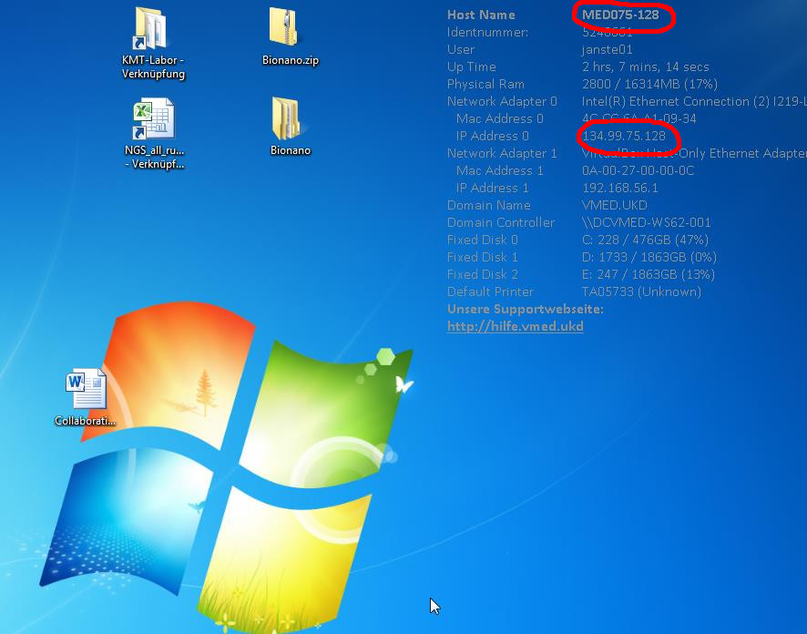

## How to access your data
There are two levels of data access. You are most likely interested in exploring your variations via the interactive browser based system [SNuPy](https://snupy-aqua.bio.inf.h-brs.de/).
However, for the advanced user, it might be necessary to access more upstream versions of your data, e.g. [bam files](http://samtools.github.io/hts-specs/SAMv1.pdf) or even [fastq raw files](https://en.wikipedia.org/wiki/FASTQ_format).
Here, I describe how to gain access to this later types of data.

There are three obstacles between you and your data:
### 1. HHU account
We are using the great service and the thousands of processors of the *High Performance Computing* (https://wiki.hhu.de/display/HPC) at Heinrich Heine University. Responsible for cluster administration is [Dr. Stephan Raub](raub@hhu.de) and is supported by the very skilled and enormously helpful [Philipp Rehs](philipp.rehs@hhu.de).
You need to have a personal HHU account (= Uni Kennung), since the data are hosted at this HPC at HHU. UKD members are generally eligible for this account, but have to apply manually via this [form](https://www.zim.hhu.de/fileadmin/redaktion/Oeffentliche_Medien/ZIM/Formulare/unikennung_gaeste_zim.pdf).
It might take up to two weeks until you get your credentials, thus better plan ahead of time.

### 2. UKD Firewall
The UKD computer network is tightly protected internet attacks or data breaches by a quite restrictive firewall. You need to ask [IT](Hotline.IKT@med.uni-duesseldorf.de) to drill a tiny hole for your needs through this big wall in order to access the data from your office computer. You do you by writing a friendly email to Hotline.IKT@med.uni-duesseldorf.de asking for this firewall rule exception. They want to know your IP address and Host Name. Both are displayed in the upper right corner of your Windows desktop:

You should furthermore state why you need this special access and might want to refer to my (Stefan Maximilian Janssen), since I had some communications with IT about this topic. Write to the generic ITK-Hotline address, but you might indicate that this request should be forwarded to the firewall specialists, currently Hans-Jürgen Herder. Last, CC Ute Fischer or me to make this request look legitimate.

### 3. HPC permissions
Once the firewall is open towards the HPC, you need to ask the administrators to grant you reading access to /gpfs/project/projects/spike/Intermediate/ or better specific subdirectories which we have to define specifically for your needs. Again, reference Ute Fischer or me for legitimization. Either use email or https://rocketchat.hhu.de/ for even faster response.

### 4. Browse your data
Once you managed the above three hurdles, you can use any (s)FTP client to access your data. You might want to use a program with a graphical user interface like [WinSCP](https://winscp.net/), which is in the lucky case already installed on your machine or you have to ask IT to install it for you if you don't have the necessary right to install software yourself.
When you first start WinSCP, it asks for the address to which you want to connect. Fill the necessary fields like in the following screenshot (sorry for German version):

In short: 

 - IP-address is: 134.99.128.206
 - use non-default port: 2223
 - username: HHU account (not necessarily the same as your UKD account)
 - password: whatever you set as password for your HHU account
