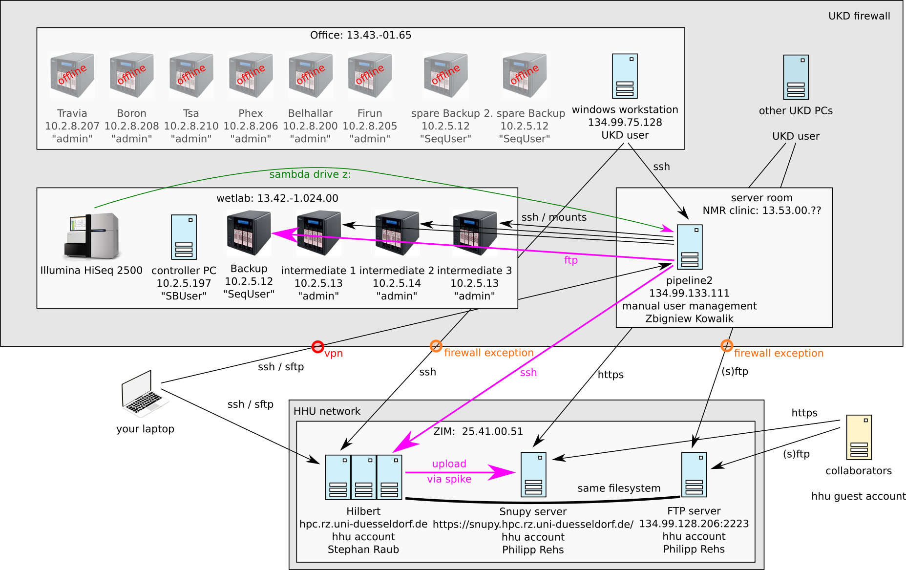

You can use this document to be guided through the multiple steps to process new (HiSeq) sequencing data.

 0. **Get sample sheet from wetlab crew and validate**
    Unfortunately, people are very lazy when it comes to the sample sheet. Without this document, you don't know what the samples to be sequences are about and cannot proceed processing them. It needs some social engineering to make this point clear. Furthermore, consistent typing of e.g. project names is not always achived. Thus, you need to put extra efforts into sample sheet curation. Additionally, you have to fill in the information about the `spike_entity_id`, `spike_entity_role` and maybe other important data that impact `spike`s processing. [More about sample sheets.](samplesheet.md)
    
    Finally, you should add the new sample sheet (one per flowcell) to the `data/samplesheets` sub-directory (double check it does not contain personal information like patient names!!) and copy it to the input directory of your `spike` installation at the HPC, most likely `/gpfs/project/projects/spike/Inputs/SampleSheets/` (but this can be configures in `config.yaml`).
    
    One erroneously formatted sample sheet can prevent processing of **everything** within `spike`, since *all* sample sheets are read and merged in the very beginning. There is a python function that can validate some aspects - you better use it, see: [More on sample sheets](samplesheet.md) or be very careful with actual execution.
 1. **Transfer raw data to HPC**
    Currently, the HiSeq Instrument is controlled by a Windows PC. The directory `/data/pipeline_in/` of the pipeline server is mounted to this Windows PC as drive `Z:` and new raw data are copied not only to local drives `D:` and `E:`, but also to `Z:`.
    
    SSH into the pipeline server (`134.99.133.111`) and use `rsync` to transfer the raw data from the UKD to the HPC network, best by:
    1. opening a new `screen` session (`screen -S transfer`)
    2. navigate (`cd`) to `/data/pipeline_in/`
    3. `rsync -p -L -r -a -v -e ssh 190327_SN737_0463_BCCN4KACXX jansses@storage.hpc.rz.uni-duesseldorf.de:/gpfs/project/projects/spike/Inputs/Raw_Illumina/`
       
       Of course, you have to replace `190327_SN737_0463_BCCN4KACXX` by the directory of your flowcell, `jansses` by your username at the HPC, and you maybe have to adopt `/gpfs/project/projects/spike/Inputs/Raw_Illumina/` to the actual file path where you want to copy the data to.
       You can also provide multiple directories, in case two flowcells were sequenced in one run.
    4. now wait until transfer is complete. You can disconnect the screen session by hitting the keys `CTRL + a` and than `d` and later reconnect by `screen -dr transfer`.
 2. **Backup raw data to NAS**
    Our backup strategy is quite primitive, as we use multiple individual NAS systems. They are stored in office 13.43.-01.65. The latest one is located in the wet lab room with the HiSeq as "the backup NAS" with IP `10.2.5.12`. We bundle and compress all raw files of each flowcell (which are automatically copied from the controller PC to drive Z:, which is `/data/pipeline_in` on the pipeline server, via this pipeline.
  
    SSH into the pipeline server (`134.99.133.111`)
    1. create the sample sheet (please see [spike/docs/samplesheet.md](spike/docs/samplesheet.md) for more details) and copy it to this directory at the pipeline server `/data/Spike_data/Inputs/SampleSheets/`
    2. open a new `screen` session (`screen -S backup`)
    3. navigate (`cd`) to your installation directory of `spike`.
    4. limit the samples known to the pipeline to those of the latest run:
       Information about samples is stored in a [pandas DataFrame](https://pandas.pydata.org/pandas-docs/stable/getting_started/10min.html) called `SAMPLESHEETS` of the main [Snakefile](../Snakefile#L31). You should add a new line above the statement that prints information about the number of samples and projects which starts as `print("%i samples in %i projects."` to subset `SAMPLESHEETS`. For example, you could limit to only those samples of a specific `run` (the better term would have been flow cell, since you can have two flow cells per run - but I haven't had the time to chance that term in spike): `SAMPLESHEETS = SAMPLESHEETS[SAMPLESHEETS['run'].isin(['190327_SN737_0463_BCCN4KACXX'])]`.
       
       For a typical run with two flowcells, you can simply extend the list of valid *runs* e.g. `SAMPLESHEETS = SAMPLESHEETS[SAMPLESHEETS['run'].isin(['190327_SN737_0463_BCCN4KACXX', '190327_SN737_0463_BCCN4KACXX'])]`
       
       **warning:** on the pipeline server, you need to do this limiting as most of the raw flow cell data is no longer present on this machine, causing `spike` to fail and complain about e.g.
        ```Building DAG of jobs...
           MissingInputException in line 1 of /home/layal/spike/rules/demultiplex/Snakefile:
           Missing input files for rule check_complete:
           /data/Spike_data/Inputs/Raw_Illumina/151006_SN737_0367_BC7L4PACXX/RTAComplete.txt
     5. double check that following settings in file [`config.yaml`](../config.yaml) are properly set:
        1. `dirs`: `prefix` should be the main working data directory for spike. At the pipeline server, this is currently `/data/Spike_data/`
        2. ensure the default temporary directory has sufficient free disk space. This is currently not the case on the pipeline server. Therefore, you must set `dirs`: `tmpdir` to `/data/tmp/`.
        3. you might also want to use your email address for the mail that is automatically sent by `spike` once the backup has been copied to the backup NAS and has been validated. Edit the [config.yaml](https://github.com/sjanssen2/spike/blob/2f83a03701ba107163a00ff13d5a0441aac38b93/config.yaml#L18) file in a way that the first address in `emails`: `backup_validated` is yours. Following addresses, separated by `,` are used as *suggested recipients* and do **not** automatically receive this email - for now.
        4. check user credentials for the backup NAS. On the pipeline server, it should look like the following, but the password `thisisasecret` must be replaced by the right one.

          ```credentials:
               backup:
                 host: '10.2.5.12'
                 username: "SeqUser"
                 password: "thisisasecret"
                 targetdirectory: "array1/Sequencing_Backups/Illumina_HiSeq"
      6. execute snakemake, first as a dry run: `snakemake -p --use-conda --cores 30 -r backup -n`
      7. double check if number of reported samples match your expectations. If so, start the actual processing by `snakemake -p --use-conda --cores 30 -r backup`, i.e. the same as above without `-n`. Expected runtime for a flow cell backup is roughly one day!
      8. after sucessful execution, `spike` should send a report via email. Once double checked, you can forward this email to the wet lab crew to let them know that the data are savely stored in our backup. They can than free up disk space on the controller PC to prepare the next run. Otherwise, limited hard disk space will not allow to start another run.
      9. From your Windows PC within the UKD network, you should be able to access the web interface of the backup NAS, by entering `https://10.2.5.12` in your favorite browser. User name is `admin`, password is known by e.g. Ute Fischer. Within this interface, you can check free capacity of the NAS. If space is running out, order a new one via a "Bestellschein". You should always have a spare NAS on the shelf in our office, such that you can directly replace. Currently, there are two spare ones - you should be good for ~1 year.
      10. Once raw data have been transferred to the HPC and are savely packed on the NAS, you should delete the data in `/data/pipeline_in/` to free up space.
 4. **Execute spike**
    SSH into the hpc: `jansses@hpc.rz.uni-duesseldorf.de`
    
    1. Subset processed samples.
       As in the backup task, you most likely want to avoid processing all samples in `spike` at once (mainly because there are so many unprocessed ones, which first need to properly described - which is work in progress). However, Samples are sometimes split across lanes or even across flow cells / runs. Furthermore, processing often times requires multiple samples, e.g. father, mother, patient for trio computations. Thus, you need to make sure that all required samples are in your subset which is not necessarily just the samples of the current run. If you e.g. process new `Keimbahn` samples, you should always naturally include all Keimbahn samples - but there are a few samples originating from other projects but also being used in the `Keimbahn` study (so called *alias* samples). Thus, you need to have those alias samples in your subset as well. I have a short cut for the `Keimbahn` situation. Just change `False` to `True` in the if condition in this line of the [main Snakefile](../Snakefile#L24). Assuming your flow cell `190327_SN737_0463_BCCN4KACXX` contains only samples from the `Alps` project, you could limit the samples in `spike` by adding this line `SAMPLESHEETS = SAMPLESHEETS[SAMPLESHEETS['Sample_Project'] == 'Alps']`
       
    2. open a new `screen` session (`screen -S spike_alps`)
    
    3. When ssh'ing to the HPC, you land on the head node. You should not do any serious computation on the machine, since it will very quickly negatively impact other users and the HPC will block you! To avoid this, request an interactive cluster session to get decend compute power `qsub -I -A ngsukdkohi -l mem=10GB -l walltime="50:29:50,nodes=1:ppn=1"`, which means one CPU for ~50 hours (`spike` should not take longer than that for your sampels) and 10 GB of RAM.
    
    4. `cd` into your spike install directory.
    
    5. execute snakemake, first as a dry run: `snakemake -p  --cluster-config cluster.json --cluster "qsub -A {cluster.account} -q {cluster.queue} -l mem={cluster.mem} -l walltime={cluster.time},nodes={cluster.nodes}:ppn={cluster.ppn}" -j 100 --latency-wait 900 --use-conda --cluster-status scripts/barnacle_status.py --max-status-checks-per-second 1 --keep-going -n`
    
       Double check if number of samples and tasks match to your expectations, e.g. check how many demuliplexing steps will be executed. If more than 8*#flow cells, something odd might go on and you should inspect very closely why more demuliplexing steps are necessary.
       
    6. Trigger the actual multi parallel execution of the pipeline: `snakemake -p  --cluster-config cluster.json --cluster "qsub -A {cluster.account} -q {cluster.queue} -l mem={cluster.mem} -l walltime={cluster.time},nodes={cluster.nodes}:ppn={cluster.ppn}" -j 100 --latency-wait 900 --use-conda --cluster-status scripts/barnacle_status.py --max-status-checks-per-second 1 --keep-going`
    This will compute for ~2 days for a typical scenario. You might want to disconnect your screen session properly, but come back and check status from time to time. Some of the jobs will fail, due to file system latency at the HPC, i.e. the job finished succesfully, but Snakemake could not find the output file on time. This will stop further processing for this sample and in the end you have to re-start snakemake once again - however, all completed jobs will be found and only the missing jobs need to be executed.
    
    7. Around 1 or 2 hours after you started snakemake, it will have finished demultiplexing and will automatically send you an email with attached demultiplex reports and first base statistics. You should manually inspect for oddities (e.g. close to no yield for samples, or high levels of unassigned barcode reads) and report to the wet lab crew, e.g. by forwarding them this email. They need this kind of feed back for their own logs, so please don't forget to let them know!
    
    8. Upload results to Snupy. In principle, uploading results of spike processing to [SNuPy](https://snupy.hpc.rz.uni-duesseldorf.de/) is part of the pipeline. However, I made it my good practice to avoid automatic upload by setting the password to something invalid to have a chance to first inspect results. Also note that we currently have two different SNuPy instances: the original one in Bonn and the new one at HHU. You can conveniently chance the instance by setting the global variable `SNUPY_INSTANCE` in the main Snakefile to either `hhu` or `bonn`. According settings can be changed in the `config.yaml` file, e.g. your credentials. Just re-execute spike as in step 6 after saving a valid password. Unfortunately, `SNuPy` need two dependend steps to make results available for users: a) upload and b) extraction. Thus, you need to execute spike again two times. The first time, it will upload VCF files to `SNuPy` and error on the second task. Wait until everything has been processed by `SNuPy` and re-execute `spike` for a last time. It will trigger sample extraction in `SNuPy`.
    
    9. Once everything is done, you should inform investigators that their samples are ready for being explored / analysed in `SNuPy`. You should also generate a *status_update* Excel file, by running `spike` as follows: `snakemake --force status_update.xlsx`. It will generate / overwrite the file `status_update.xlsx`, which you can than attach to the email you should send to the investigators. It includes yield and coverage statistics as well as numbers of found mutations.

## Infrastructure
The following schema shows which machines are used for the NGS processing, how they are connected, that the UKD firewall is making your job more complicated and how data should "flow".

Black arrows indicate how you can communicate / control different machines. Green arrows show how data are autmatically copied / moved by the existing setting and magenat arrows indicate what you have to do to process the data. i.e. you get the data from the Illumina instrument, back them up on a NAS and process them at the HPC to finally upload results to `SNuPy`.

# Troubleshooting
  1. `conda: command not found`
  
      The conda binary might not be found in the directories listed in your PATH (https://en.wikipedia.org/wiki/Environment_variable)[environment variable]. The reason might be that your default are not loaded properly on the HPC. Try to enforce that by creating (if it does not exist) or editing the file `~/.profile` (the leading `.` means it is a hidden file and `~/` means it is stored in your home directory, e.g. `/home/jansses/`. Add the following two lines to the file:
      Don't forget to replace `jansses` with your user name!
      
      ```export PATH="/home/jansses/miniconda3/bin:$PATH"
         source /home/jansses/.bashrc
         
  2. `Could not run prolog: pro/epilogue failed, file: /var/spool/pbs/mom_priv/prologue, exit: 1, nonzero p/e exit status`
     
     The reason might be, that you are not (yet) added to the correct HPC project `ngsukdkohi`. Once your HPC account get's granted, you are assigned to at least one project which might be another than `ngsukdkohi`. Let the HPC guys know about this misconfiguration. Meanwhile, you can edit the defaul `account` in [cluster.yaml](../cluster.json#L4) and set it to your project.
